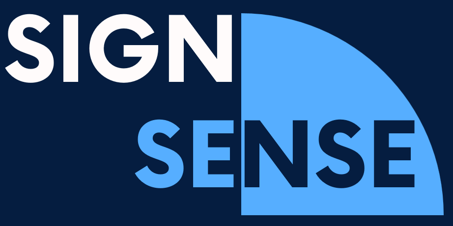
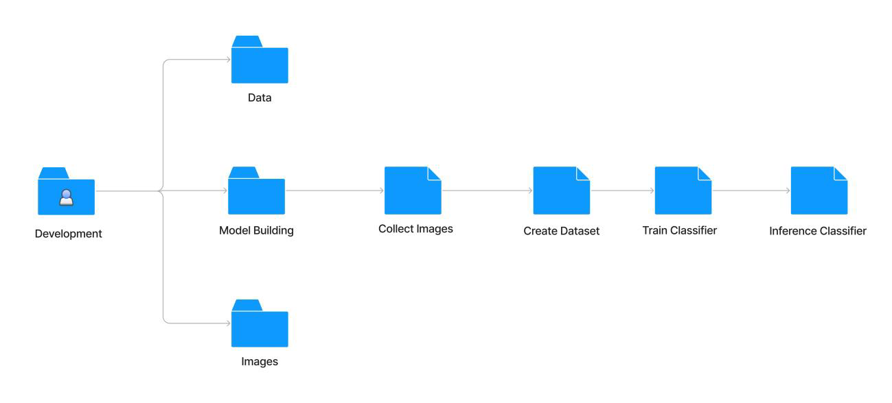
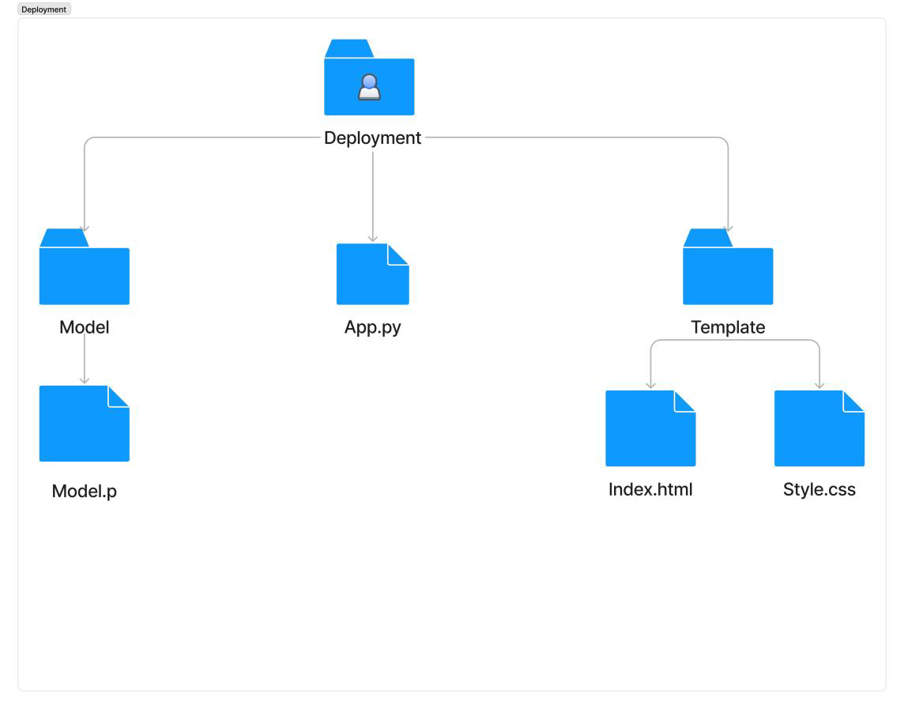

 
 

<h2>SignSense </h2> 

<h3> Sign Language Detection & Translation Web App </h3>
<strong>Developed By - </strong>
<ul>  
  <li> <a href = "https://www.linkedin.com/in/atharva-kadam-07b101228/" target = "_blank">Atharva Kadam</a></li>
  <li> <a href = "https://www.linkedin.com/in/aditya-ace/" target = "_blank" >Aditya A</a></li>
  <li> <a href = "https://www.linkedin.com/in/makarand-warade-9a1b32230/" target = "_blank" >Makarand Warade</a></li>
  
  
  
</ul>

 

## Toolset 🛠️
<i> Languages, Equipments, Environment </i>

 

## OverView 🔎

 
SignSense is a sign language detection system aimed at bridging communication gaps for the hearing impaired.

 <i>
<a href = "https://en.wikipedia.org/wiki/Sign_language" target="_blank">Sign Language</a> is a vital means of communication for millions of individuals worldwide, particularly those who are deaf or hard of hearing. This software, aptly named SignSense, leverages Computer Vision and Machine Learning techniques to Detect and Translate Sign Language Gestures into Text in real time.
 
</i>

## Development 🔧

 The project development has been divided into two parts, Model Development & Front-End Integration. 

### Model Development 

This stage involves creation of the Machine Learning Model, and exporting it inorder use in integration. 
<li>Dataset Creation</li>
<li>Data Processing</li>
<li>Model Training</li>
<li>Model Testing</li>
<li>Model Export</li>
 

### Front End Integration 

This stage involves creation of the Integrated ML Model with Front End using Flask Framework. 
 

## Implementation 🖑🏾
1. Simply Download 
2. Open PowerShell in your downloaded directory and run the following command.
    <pre><code>pip download -r requirements.txt </code></pre>

3. Once the Process is Complete, run the following Commands.
    <pre><code> cd Deploy </code></pre>
    <pre><code> python app.py </code></pre>
    
    Click on the link, and the browser window would pop up. 

## Update
To create your own model follow the following steps. 
1.  <pre><code>cd Model</code></pre>
2.  <pre><code>python collect_imgs.py</code></pre>
  Enter the No. of letters you want to train and the number of images you want to collect for each letter. 
  To start capturing press G. 
  
3. <pre><code>python create_dataset.py</code></pre>
4. <pre><code>python train_classifier.py</code></pre>
5. <pre><code>python test_classifier.py</code></pre>

Then copy the model.p into the Models directory of Deployment Folder and Simply follow the Implementation. 

  
  
<footer><strong><i>Any Suggestion, Contribution and Forking is Highly Appreciated!!</i></strong></footer>

